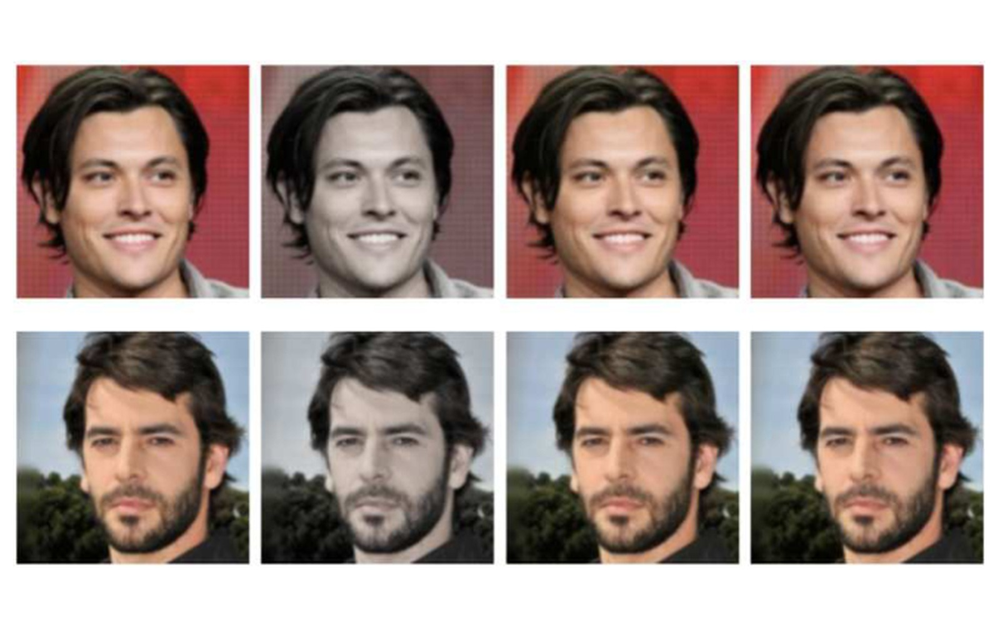

# Cold Diffusion for Image Restoration

PyTorch reimplementation of the Cold Diffusion framework (Bansal et al., 2022),
testing whether deterministic image degradation can be inverted without stochastic noise.

Bachelor thesis, BSc in Artificial Intelligence — University of Pavia,
University of Milano-Bicocca, University of Milan, 2024–25.
Supervisor: Prof. Claudio Cusano.



*Left to right: original, desaturated input, classical baseline, Cold Diffusion output.*

## Task

Standard diffusion models corrupt an image with Gaussian noise and learn to reverse
that process. Cold Diffusion replaces the noise with a deterministic degradation
operator and trains a network to invert it step by step.

Two operators were implemented, chosen to sit at opposite ends of invertibility:
progressive colour desaturation, which removes chromatic information but preserves
spatial structure, and Gaussian blur, which removes high-frequency content
irreversibly.

## Method

**Data.** CelebA-HQ, resized to 128×128 and mapped to [−1, 1]. Training on an
8,000-image subset.

**Forward operators.**

| | steps | parameters |
|---|---|---|
| DeColor | T = 50 | progressive blend towards per-pixel luminance, α up to 0.7 |
| Gaussian blur | T = 6 | σ from 0.4 to 2.0, 7×7 kernel per sample and channel, grouped convolution |

**Reconstruction network.** A U-Net takes the degraded image concatenated with a
broadcast time-encoding map `t/(T−1)` and predicts the clean image directly, trained
on an L1 objective. No noise prediction and no variational bound. Two variants: a
compact ~0.6M-parameter network for DeColor and `UNetDeblur` (`base_ch = 28`, two
down/up stages with skip connections) for the blur operator.

**Sampling.** Both algorithms from the paper are implemented. Naive inversion
(Algorithm 1) reapplies the operator to the predicted clean image and accumulates
error along the trajectory. Reconstruction uses the residual-correction update
(Algorithm 2):

    x_{t-1} = x_t − D(x̂_0, t) + D(x̂_0, t−1)

which cancels the first-order term of the degradation operator.

**Training.** Adam, learning rate 2e-4, batch size 8, mixed precision, single Colab T4.

**Evaluation.** 80 held-out images for DeColor, 200 for deblurring, 300 for FID.
Classical baselines applied to the same 15×15, σ = 2.0 blur.

## Results

**DeColor**

| PSNR ↑ | SSIM ↑ |
|---|---|
| 38.01 | 0.986 |

LPIPS remains near zero across the trajectory and is not informative as a global value.

**Gaussian deblurring**

| Method | PSNR ↑ | SSIM ↑ | LPIPS ↓ |
|---|---|---|---|
| **Cold Diffusion** | **28.67** | **0.894** | **0.1725** |
| OpenCV sharpen | 28.36 | 0.850 | 0.1931 |
| Wiener-like filter | 23.18 | 0.666 | 0.3868 |

FID between reconstructions and real images: 64.02.

The learned inverse outperforms Wiener filtering on all metrics. Against the
sharpening baseline the PSNR difference is marginal, but SSIM and LPIPS are both
better: sharpening increases edge contrast without reconstructing texture.

The difference between the two operators quantifies the dependence of reconstruction
quality on operator invertibility. Colour desaturation preserves geometry and inverts
almost exactly; blur discards high-frequency content, and the pixel-wise error
distribution concentrates its long tail in hair, edges and fine texture.

Inference requires six forward passes per image for the blur model, one to two
orders of magnitude fewer than the several hundred reverse steps of a standard DDPM.

## Limitations

A single dataset of aligned faces. Two synthetic operators; motion blur, JPEG
artefacts, spatially varying kernels and composite degradations are untested.
Compact models trained under Colab constraints. Evaluation is pixel-level and
perceptual, with no semantic or task-driven metric.

## Repository

```
notebooks/deblurring.ipynb        blur operator, UNetDeblur, both sampling
                                  algorithms, metrics, classical baselines
notebooks/decolorization.ipynb    DeColor operator, compact U-Net, evaluation
figures/                          qualitative comparisons and metric plots
```

Both notebooks are written for Colab and expect CelebA-HQ mounted from Drive.
Set `TRAIN_MODEL = True` to train from scratch; otherwise a saved checkpoint is loaded.

## Reference

Bansal et al., *Cold Diffusion: Inverting Arbitrary Image Transforms Without Noise*, 2022.
